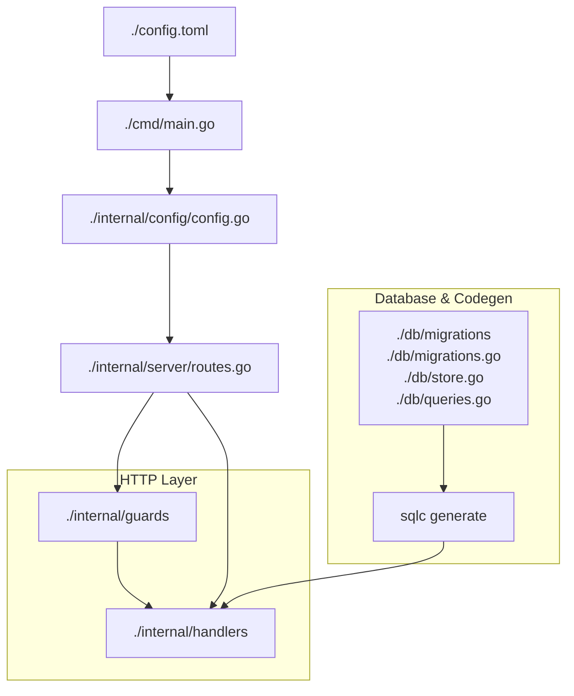

## Architecture

### The Big Picture

Each handler runs in its own goroutine, borrows exactly one DB connection for its transaction, and the database - not Go - keeps concurrent handlers from stepping on each other.

Each HTTP request is handled in its own goroutine spun by "net/http". When a handler calls db.BeginTx(...):

- It borrows one connection from the database/sql pool.

- That connection is now exclusively owned by that transaction.

- No other goroutine uses that connection.

- Other requests borrow other connections from the DB pool.

The DB itself enforces: locks, isolation, serialization rules. The Go pool only manages who gets a connection, not update correctness.

If two users register at the same time: two goroutines, two transactions, two connections. The database decides who waits, who retries, who conflicts.

### Code Organization

A rough overview:



More details:

- ./cmd - entrance points to `server` and `god` (independent user management cli).

- ./data/data.db - SQlite DB. Populate it via REST API or ./bin/god. Tests will directly pollute it, use ./bin/god to clean up.

- ./db - mostly sqlc generated, except store.go and migrations.go.

- ./internal

  - config/config.go - default params, validation, fatal failures.

  - ./handlers

    - register, login, profile, logout.

    - domain_helpers.go related to db, sessions, not json/http stuff.

  - httpx - "x" for extras, json/http helpers used by both: handlers and guards.

  - guards - middleware, mostly to fight bots. Guards do not touch DB.

  - server/routes.go - this is where all the middleware and handlers are assembled.

  - config.toml - user defined parameters with defaults inside config.go.

These rules eliminate 80 percent of the mess:

- A guard is never nil, disabled means inactive, not absent.

- Defaults + validation + fatal errors live in config, no paranoid checks elsewhere.

- Handlers never mess with a guard, they only run a fully formed guard or a sequence of them, defined and instantiated for a specific handler inside ./internal/server/routes.go.

- A guard checks if everything is alright and returns true, or writes an HTTP response and returns false. There is no nil, error handling, panic, and exit maze.

### More about Middleware (Guards)

./internal/guards run inside a handler before business logic. They are **synchronous, and in-memory**. To chain/execute the guards in sequence we put them under a common type `guards.Guard`:

```go
type Guard interface {
    Check(w http.ResponseWriter, r *http.Request) bool
}
```

The package _guards_ breaks a cycle between ./internal/server/routes.go and ./internal/handlers.

Inside a handler an active guard will emit an HTTP response and return false. The handler exits before business logic via return:

```go
for _, g := range h.Guards {
    if !g.Check(w, r) {
        return
    }
}
```

See ./internal/handlers/register.go as an example.

You will find the following tested guards inside ./internal/guards:

- ip_rate.go - HTTP request rate per ip limiting.

- body_size.go - request body size cap.

- pow.go - optional [Proof-of-Work](docs/proof_of_work.md) challenge.

./internal/handlers/register.go also includes [Maximal Accounts per IP](accounts_per_ip.md),

```go
limiter := guards.NewAccountPerIPLimiter(
		h.AccountPerIPLimiter,
		txStore.CountUsersByIP,
	)
```

It needs to access db via txStore, which runs a transaction controlled by the api/register handler. Treat those stateful guards as handler's business logic, details in ./internal/handlers/register.go.

This way we cover (more or less) complex Ruby Rack machinery with basic typed Go code.
